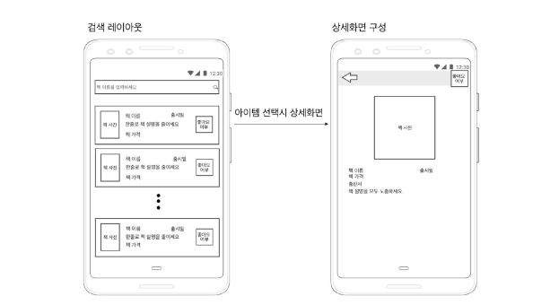

# tw-book-assignment
purposes: android assignment

# 도서 검색 앱
## 개발 가이드
- Architecture: MVC, MVP, MVVM 선택
- Async: RxJava, Coroutines 선택
- Library: 오픈소스 라이브러리 자유롭게 사용
- Language: Kotlin
## 기능 요구 사항
- sdk
  - min: 23, target: 30
- 도서 검색
  - 카카오 도서 API 사용 (https://developers.kakao.com/docs/latest/ko/daum-search/dev-guide#search-book)
  - 단, size param은 50으로 설정해 page당 50권이 검색되도록 개발
- paging
  - 스크롤 시 paging 기능을 제공해 연속적으로 검색
- 검색 리스트 결과(메인화면) 및 상세화면으로 구성(서브화면)
- 1개의 Activity와 2개의 Fragment로 구성
  - 검색 리스트 결과 화면
  - 검색 결과에 대한 상세 화면
- 검색 결과 상세 화면에서 좋아요 기능
  - 좋아요를 누르면 리스트에 반영되어야 하며, 좋아요 데이터는 새로운 검색을 시작하면 함께 초기화
  
## 책 검색 리스트 화면 구성
- 메인화면 - 도서명 검색 기능
  - 상단에 도서명을 입력할 수 있는 입력 창을 제공해 도서명이 변경되면 해당 도서명으로 검색 결과 노출
    - 검색 결과는 실시간으로 리스트 반영 필요
    - 좋아요 여부는 초기화 상태 false 여야 함
  - 상세화면 - Like/Unlike 여부에 따른 리스트 반영
    - 이전 화면으로 돌아갈 경우 리스트에 반영
    - 좋아요 여부는 새로운 키워드 검색 시 초기화 되어야 함
    - 리스트 화면에서는 좋아요 클릭을 별도로 처리하지 않음
    - 메인화면 - 특정 도서 클릭 시 상세화면 이동
      - 상세화면 fragment로 이동
